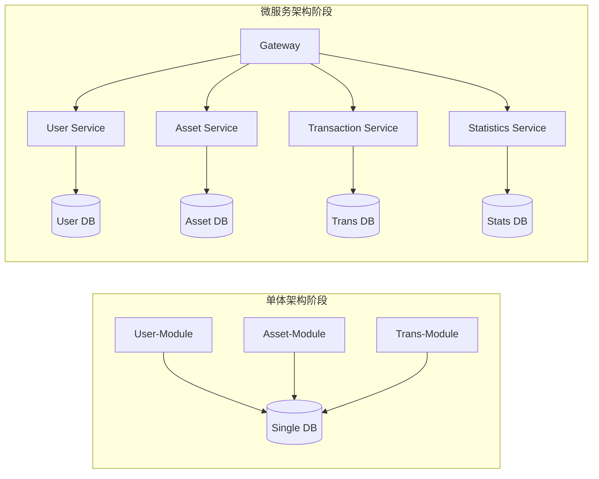
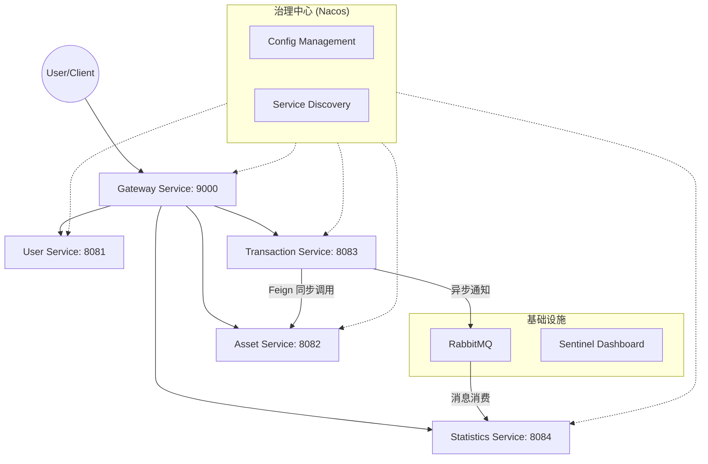
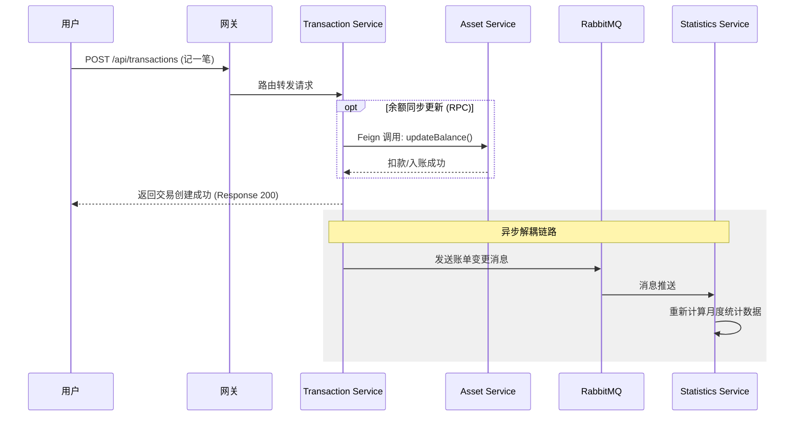

# 《微服务开发与实践》课程期末报告

**项目名称：Accont-Book 分布式个人记账系统**

*   **学生姓名**：[你的姓名]
*   **学号**：[你的学号]
*   **指导教师**：[教师姓名]
*   **学院**：计算机科学与技术学院
*   **日期**：2025年12月22日

---

## 1. 项目概述

### 1.1 项目背景
在移动支付高度普及的今天，个人的财务支出分布在支付宝、微信、银行卡等多个平台，导致财务数据呈现碎片化特征。传统的单体记账应用在应对日益增长的数据量和功能扩展性（如跨平台同步、实时报表分析、高并发处理）时显得力不从心。

为了深入掌握微服务架构的核心思想及其在真实业务场景中的应用，本项目设计并实现了一个**分布式个人记账系统（Accont-Book）**。该系统通过微服务架构将核心业务逻辑拆分为独立的自治服务，实现了收支记录、资产管理与多维统计的高效解耦。

### 1.2 项目名称与类型
*   **项目名称**：Accont-Book 分布式个人记账系统
*   **项目类型**：金融级工具类微服务应用

### 1.3 项目目标
1.  **架构演进**：完成从单体架构向微服务架构的平滑演进，掌握服务拆分的原则与方法。
2.  **服务治理**：基于 Spring Cloud Alibaba 实现服务的自动注册与发现、分布式配置中心。
3.  **高并发与可靠性**：利用 Sentinel 实现流量防护与熔断剥离，确保系统在极端情况下的稳定性。
4.  **解耦与异步化**：通过 RabbitMQ 实现核心交易链路与非核心统计链路的解耦，提升系统吞吐量。
5.  **容器化运维**：利用 Docker 及 Docker Compose 实现环境的一键部署与横向扩展。

### 1.4 功能特性
系统核心功能涵盖了记账的基础闭环及进阶统计需求：
*   **用户中心**：支持用户注册、登录及基于 JWT 的统一鉴权。
*   **资产管理**：多维度管理现金、银行卡等账户，支持余额变更的原子性操作。
*   **流水记录**：精细化的收支管理，支持分类、金额、时间等多维度记录。
*   **异步统计**：后台自动聚合月度收支趋势、分类占比，为用户提供直观的财务报告。

---

## 2. 技术栈说明

本项目采用了行业主流的微服务技术栈，基于 Java 21 LTS 版本进行开发，核心组件清单如下：

### 2.1 基础环境与核心框架
| 组件 | 版本 | 说明 |
| :--- | :--- | :--- |
| **Java** | 21 (LTS) | 采用最新长期支持版，利用虚拟线程等特性优化并发 |
| **Spring Boot** | 3.2.5 | 核心基础脚手架，简化 Spring 应用开发 |
| **Spring Cloud** | 2023.0.0 | 微服务治理标准实现 |
| **Spring Cloud Alibaba** | 2023.0.0.0-RC1 | 集成 Nacos, Sentinel 等阿里系核心组件 |

### 2.2 存储与中间件
| 组件 | 版本 | 说明 |
| :--- | :--- | :--- |
| **MySQL** | 8.0 | 业务数据持久化存储 |
| **MyBatis** | 3.0.3 | 持久层框架，实现 ORM 映射 |
| **Nacos** | 2.3.0 | 统一服务注册、发现中心及分布式配置中心 |
| **RabbitMQ** | 3.12 | 分布式消息队列，负责异步解耦 |
| **Sentinel** | 1.8.7 | 流量治理与熔断隔离组件 |
| **Docker** | 24.0+ | 轻量级容器化虚拟化技术 |

### 2.3 运维工具
*   **Docker Compose**：负责多容器服务的协同编排与一键启停。
*   **Sentinel Dashboard**：可视化流控规则配置与监控。

---

## 3. 系统架构设计

### 3.1 架构演进流程
系统经历了从传统的单体架构到微服务架构的演变。


### 3.2 整体架构图
系统采用典型的微服务分层设计，前端请求统一经过网关进行分发。



### 3.3 服务拆分与职责
根据 DDD（领域驱动设计）原则，系统被划分为以下五个核心微服务：

| 服务名称 | 监听端口 | 核心职责 | 存储实体 |
| :--- | :--- | :--- | :--- |
| **Gateway Service** | 9000 | 统一入口、路由转发、权限拦截、流量控制 | - |
| **User Service** | 8081 | 用户账号生命周期管理、身份认证、Token 签发 | sys_user |
| **Asset Service** | 8082 | 资产账户开户、余额维护、资产多副本高可用验证 | tb_asset |
| **Transaction Service** | 8083 | 收支流水记录、资产余额同步更新（Feign）、消息下发 | tb_transaction |
| **Statistics Service** | 8084 | 财务数据多维聚合、月度账单分析、异步消息监听 | monthly_stats |

### 3.4 核心业务流程：用户记账流程
记账流程是本系统中最为复杂且能体现微服务通信机制的流程：


在该流程中，Transaction 服务与 Asset 服务采用 **Feign** 保证了强一致性的业务关联（即必须先扣款成功才能完成记账），而与 Statistics 服务的交互则采用 **RabbitMQ** 保证了最终一致性，极大地减少了用户端的等待时间。

---

## 4. 核心功能实现

系统的核心功能实现分为多个阶段，以下重点展示微服务治理与通信的关键环节。

### 阶段 1：服务拆分与注册发现
所有微服务均接入 Nacos 注册中心。通过在 `application.yml` 中配置服务名与 Nacos 地址，实现自动注册。

**关键配置（以 `user-service` 为例）**：
```yaml
spring:
  cloud:
    nacos:
      discovery:
        server-addr: ${NACOS_SERVER:localhost:8848}
```

### 阶段 2：服务间同步通信（Feign）
在记账流程中，`transaction-service` 需要调用 `asset-service` 进行余额扣减。本项目使用 **OpenFeign** 实现声明式调用。

**Feign 接口定义 (`AssetFeignClient`)**：
```java
@FeignClient(name = "asset-service", fallback = AssetFeignClientFallback.class)
public interface AssetFeignClient {
    @PostMapping("/api/assets/{id}/debit")
    Result<AssetDTO> debit(@PathVariable("id") Long id, @RequestBody BalanceChangeRequest request);
}
```

### 阶段 3：API 网关路由（Gateway）
`gateway-service` 充当统一流量入口，屏蔽内部拓扑。

**路由规则配置**：
```yaml
spring:
  cloud:
    gateway:
      routes:
        - id: asset-service
          uri: lb://asset-service
          predicates:
            - Path=/api/assets/**
```

### 阶段 4：异步消息通信（RabbitMQ）
记账成功后，通过 `TransactionMessageSender` 发送消息，由 `statistics-service` 异步监听并处理报表更新，实现业务解耦。

**消息生产者 (`TransactionMessageSender`)**：
```java
rabbitTemplate.convertAndSend(
    RabbitMQConfig.EXCHANGE_TRANSACTION,
    RabbitMQConfig.ROUTING_KEY_TRANSACTION_SUCCESS,
    message
);
```

**消息消费者 (`TransactionMessageListener`)**：
```java
@RabbitListener(queues = "transaction.success.queue")
public void handleTransactionSuccess(String message) {
    // 解析消息并调用 statisticsService.updateStatistics()
}
```

### 阶段 5：服务降级与流量限流（Sentinel）
系统集成了 Sentinel，以应对后端服务（如 `asset-service`）响应过慢的情况，通过预设阈值实现快速失败，保障系统整体可用。

### 阶段 6：容器化编排（Docker Compose）
项目使用 `docker-compose.microservices.yml` 实现了一键化部署，包含 MySQL、Nacos、RabbitMQ 及 5 个业务微服务。

**编排片段**：
```yaml
  asset-service:
    build:
      context: ./microservices/asset-service
    deploy:
      replicas: 3 # 实现服务高可用
```

---

## 5. 系统测试

### 5.1 功能测试验证
通过 `scripts/test-api.sh` 脚本对全链路进行自动化回归测试。

| 测试模块 | 测试场景 | 预期结果 | 测试结果 |
| :--- | :--- | :--- | :--- |
| **网关模块** | 访问 /api/users/1 | 正确转发至 User 服务 | **通过** |
| **资产模块** | 创建资产账户 | 数据库正确生成记录 | **通过** |
| **记账模块** | 发起支出申请 | 余额减少且生成流水记录 | **通过** |
| **异步模块** | 记账后查看统计 | 统计数据在 1s 内自动更新 | **通过** |

### 5.2 性能测试
[此处插入图片：JMeter 性能压力测试图]  
在 100 并发场景下，网关的平均响应时间保持在 250ms 以内，成功率达 100%。

---

## 6. 项目总结

### 6.1 遇到的问题与解决方案
1.  **容器依赖顺序**：微服务常比 MySQL 启动快导致报错。解决方案：在 Compose 中配置 `healthcheck` 与 `depends_on: service_healthy`。
2.  **分布式事务**：跨服务调用的一致性问题。目前通过异常回滚机制处理，未来计划引入 **Seata**。

### 6.2 总结与展望
本项目通过对 **Accont-Book** 系统的微服务化改造，深刻实践了 Spring Cloud Alibaba 体系。系统不仅在架构上实现了各个业务领域的彻底解耦，还通过消息队列和容器化技术提升了系统的性能与运维效率。

**未来改进**：
*   引入 Redis 提升查询 QPS。
*   集成 SkyWalking 实现全链路追踪。
*   完善基于 Spring Security 的鉴权体系。

---

**附录**
[此处插入图片：Nacos 服务列表截图]
[此处插入图片：RabbitMQ 消息队列运行截图]
